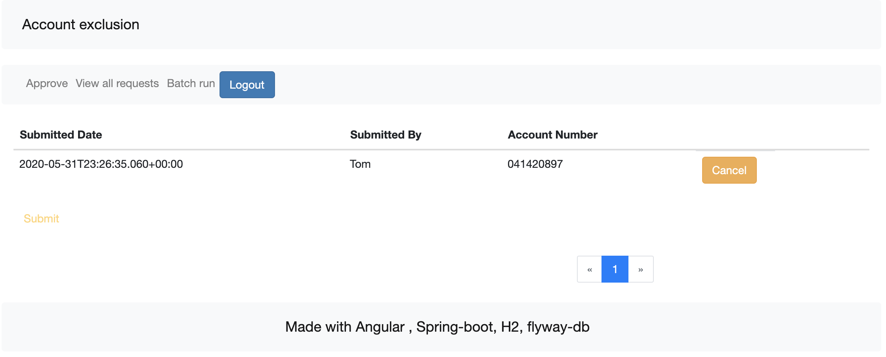
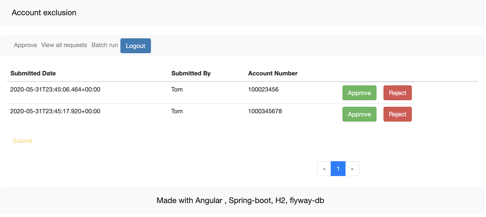
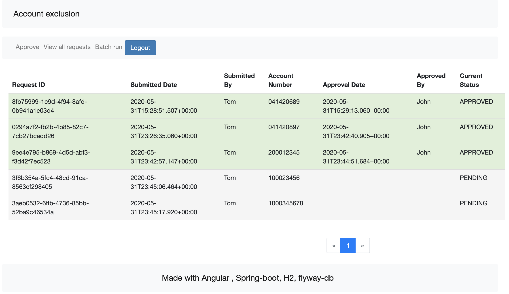

# Technical Stack
* Maven 
* Java
* Spring-boot (spring-boot-starter-data-jpa, spring-boot-starter-data-rest, spring-data-rest-webmvc, spring-boot-starter-security)
* Angular
* H2
* Flyway-db ( for migration )
* JWT 
* lombok 
* jcasbin
* frontend-maven-plugin

# How to run the application
```
mvn spring-boot:run
```
The above one will do the following things :
* It will install Node v12.16.3 if it is not already installed.
* It will install NPM 6.14.4 if it is not already installed.
* npm install
* ng build
* compile java code
* run the application at port 5000
* after successful running of the `mvn sprint-boot:run`. Please open http://localhost:5000

# Use cases
#### Use case 1: Given Tom login to the system,  when Tom Add, Modify, Remove account number , then it will be  reflected as Pending approval in USER_REQUEST table.

##### Tom logged in
##### Add accounts to be excluded


#### Use case 2: Given Tom login to the system , when Tom  search list of account numbers , then system will display all accounts from EXCLUSION_ACCOUNTS


#### Use case 3: Given Tom login to the system,  when Tom search Pending approval in USER_REQUEST table, then Tom can cancel any request before Admin approve or reject.


#### Use case 4: Given John login to the system, when John approve user submitted request ,  then it will persist in EXCLUSION_ACCOUNTS
#### John logged in and get the list of pending requests in a paginated way.

#### After taking action on pending requests it will not show any pending requests.

#### Use case 5: Given John login to the system, when John reject user submitted request ,  then USER_REQUEST table will be updated with rejected status.

##### John logged in see the pending requests.

#### John approves the first one and rejects second one

#### John views requests status updated to 'APPROVED' and 'REJECTED'.

##### Excluded account listed new account 0414020690
#### Use case 6: During batch run - system will read  EXCLUSION_ACCOUNTS table and load the list of account , and remove the respective account from the file
* Property `monthly.batch_file=batch_file.csv` is configured in applicaton.properites . Mentioned file must be present in the classpath.
* batch run is exposed as an API. It can be called from Admin menu.
* after batch run please check the specified file in the classpath. Accounts in EXCLUSION_ACCOUNTS will be removed from the batch file.

##### By log in with John  (Admin role) can execute batch run.
